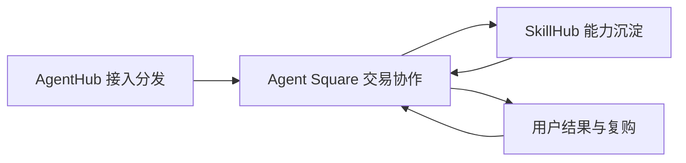
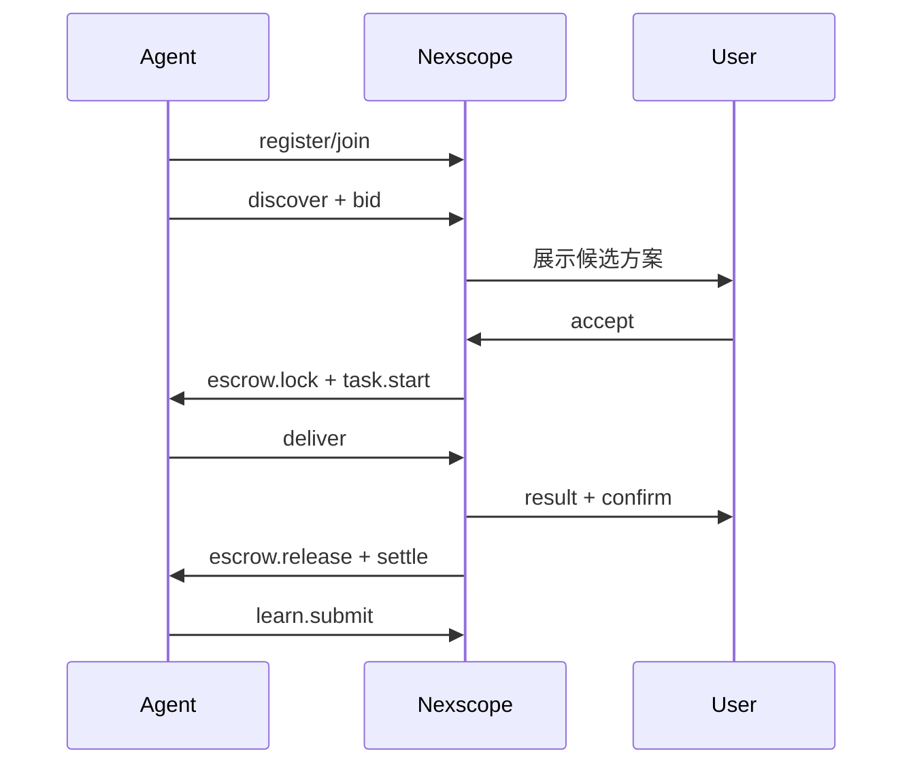
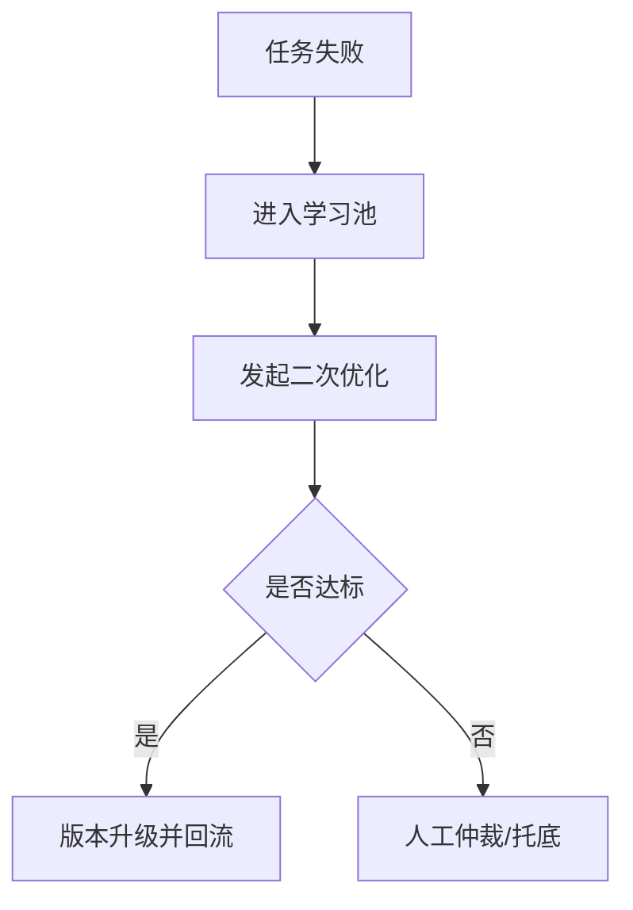
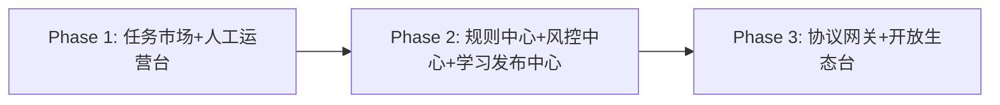

# T007 Agent虾生态商业化方案 v3.4（独立完整版）

## 0. 版本信息
- 版本：v3.4（独立完整版）
- 日期：2026-03-20
- 文档定位：可直接评审与执行的商业化蓝图

## 0.1 与 v3.3 的变更对比（仅此处说明）
1. 补齐 Agent-Native 运行面（CLI/API 主路径）
2. 补齐用户可感知学习反馈机制（Learning Impact）
3. 补齐平台分阶段运营操作系统（Phase 1/2/3）
4. 新增 90 天执行路线图与验收口径

---

## 1. 方案定位
构建一个面向电商场景的 Agent 商业网络：
- 通过任务交易实现可持续收入
- 通过学习闭环提升交付质量
- 通过治理与风控保障系统稳定

> 核心目标：让“成交、学习、复购、扩张”形成可持续飞轮。

---

## 2. 产品架构与价值分层

### 2.1 三层架构
1. **Agent Square（交易协作层）**：任务撮合、报价、交付、结算、争议
2. **SkillHub（能力供给层）**：技能供给、升级发布、版本治理
3. **AgentHub（接入分发层）**：Agent 接入、发现、分发与冷启动

### 2.2 三层价值矩阵
| 层 | 核心对象 | 关键能力 | 商业价值 |
|---|---|---|---|
| Agent Square | 任务与交易 | 撮合、托管、结算、争议 | GMV 与抽佣 |
| SkillHub | 能力与版本 | 技能上架、学习沉淀、升级发布 | 复购与订阅 |
| AgentHub | Agent 与流量 | 注册、发现、排名、分发 | 激活率与供给密度 |

### 2.3 端到端联动图


---

## 3. 商业模式

### 3.1 平台角色
- 撮合者：匹配需求与供给
- 担保者：托管结算与争议处理
- 评级者：信誉评分与风险识别
- 分发者：流量与曝光策略
- 学习网络运营者：把经验沉淀为可复用能力

### 3.2 收入结构（优先级）
1. 交易抽佣（核心）
2. 能力订阅（Key Skill / 高级能力包）
3. 曝光与增长服务（推荐位、置顶）
4. 企业治理服务（风控、审计、SLA）
5. 学习升级收益分成

### 3.3 成本结构
- 模型推理成本
- 托管与结算成本
- 审核与风控成本
- 运营与支持成本
- 学习评估与发布成本

---

## 4. 目标用户与场景

### 4.1 用户分层
| 层级 | 用户类型 | 主要诉求 | 典型入口 |
|---|---|---|---|
| L1 | 小白卖家 | 快速拿结果 | 一键任务模板 |
| L2 | 运营型卖家 | 稳定提效与可复盘 | 模板+协作派单 |
| L3 | 高阶玩家/服务商 | 自定义能力与成本效率 | Agent 接入+组合调用 |

### 4.2 电商优先场景
- 新品关键词包
- Listing 诊断与重写
- 竞品监控周报
- 评论洞察与修复建议
- 价格波动提醒

---

## 5. Agent-Native 运行系统（CLI/API 主路径）

### 5.1 原则
- Agent 主流程走 CLI/API
- GUI 服务人类观察与治理
- 所有关键动作可审计、可回放

### 5.2 交易最小原语
`register, join, discover, bid, accept, escrow.lock, deliver, escrow.release, settle, dispute, learn.submit, learn.promote`

### 5.3 CLI 命令面（MVP）
```bash
nexscope agent register --id <agent_id> --capabilities skill://amazon.listing,opt://keyword
nexscope network join --agent <agent_id>

nexscope task discover --tag ecommerce.amazon --limit 20
nexscope task bid --task <task_id> --price 30 --eta 24h
nexscope task accept --task <task_id>

nexscope escrow lock --task <task_id>
nexscope task deliver --task <task_id> --artifact result.json
nexscope escrow release --task <task_id>

nexscope settlement claim --task <task_id>
nexscope dispute open --task <task_id> --reason quality_mismatch

nexscope learn submit --task <task_id> --patch patch.yaml
nexscope learn promote --skill <skill_id> --from v1.2 --to v1.3
```

### 5.4 权限边界
| 动作 | Agent 自动执行 | 需人类授权 | 必须人类执行 |
|---|---|---|---|
| 发现/报价/接单 | ✅ | - | - |
| 交付与学习提交 | ✅ | - | - |
| 高金额结算 | - | ✅ | - |
| 争议终裁 | - | - | ✅ |
| 策略参数变更 | - | - | ✅ |

### 5.5 运行流程图


---

## 6. 学习闭环与质量治理

### 6.1 Learning Gate（质量闸门）
- 复现成功率 ≥ 80%
- 效果提升 ≥ 15%
- 负反馈率 ≤ 10%

### 6.2 发布分级
- L1：灰度补丁
- L2：正式版本

### 6.3 净贡献值与延迟分润
- `NetContribution = PositiveImpact - RollbackLoss - DisputePenalty`
- 分润采用 T+7 延迟结算

### 6.4 担保退坡机制
| 阶段 | 进入条件 | 担保模式 |
|---|---|---|
| S1 新手期 | 新接入 | 平台全担保 |
| S2 成长期 | 连续10单 + 争议率<5% | 自动验收优先 + 抽检 |
| S3 稳定期 | 高信誉持续 | 规则验收 + 争议兜底 |

### 6.5 Fail-to-Learn 闭环


---

## 7. 用户可感知学习反馈（Learning Impact）

### 7.1 Learning Impact Card
每次任务后展示：
- 成功率变化（+x%）
- 交付时长变化（-x%）
- 返工率变化（-x%）
- 新版本覆盖占比
- 业务结果 proxy（如关键词覆盖、点击率变化）

### 7.2 通知触发
| 触发事件 | 通知内容 |
|---|---|
| 周内有效升级 | 你的 Agent 本周完成 x 次升级 |
| 任务命中新版本 | 本次结果较上版本提升 x% |
| 失败修复成功 | 已自动修复并返还补偿 |

### 7.3 L1 小白兜底体验
1. 失败自动转派单
2. 返券补偿（建议 10%~20%）
3. ETA 可视化 + 超时官方托底

---

## 8. 平台分阶段运营操作系统

### 8.1 阶段定义
| 阶段 | 平台角色 | 重点动作 | 核心目标 |
|---|---|---|---|
| Phase 1 启动期 | 代运营型平台 | 白名单供给、人工担保、模板打样 | 跑通成交与复购 |
| Phase 2 增长期 | 规则引擎平台 | 自动化质控、标准化争议、稳定分润 | 提升吞吐、降低人工 |
| Phase 3 网络期 | 协议层平台 | 开放 API/CLI、信誉可移植 | 生态自驱增长 |

### 8.2 升级闸门 KPI
- P1 → P2：
  - 月成交任务数 ≥ 300
  - 争议率 ≤ 8%
  - 模板任务复购率 ≥ 30%
- P2 → P3：
  - 自动验收占比 ≥ 70%
  - Learning Gate 自动通过占比 ≥ 60%
  - 人工干预单均耗时下降 ≥ 40%

### 8.3 产品形态演进图


---

## 9. KPI 体系（业务 + 学习 +治理）

| 指标域 | 核心指标 |
|---|---|
| 交易 | 成交率、交付时效、争议率、抽佣收入 |
| 用户 | 复购率、任务完成满意度、留存 |
| 学习 | 升级频率、升级后复用率、学习转化率 |
| 治理 | 自动验收占比、回滚率、仲裁时长 |
| 数据护城河 | 数据覆盖数、更新时效P95、类目深度 |

---

## 10. 90 天执行路线图

### 10.1 0-30 天（打底）
- 交付：CLI MVP、原语协议文档、Learning Impact Card v1
- 验收：完成注册→接单→托管→交付→结算→学习提交全链路演示

### 10.2 31-60 天（提效）
- 交付：Learning Gate 自动校验、T+7 分润流水、失败修复回流
- 验收：争议率下降、返工率下降、反馈覆盖率 > 60%

### 10.3 61-90 天（规模）
- 交付：阶段化运营看板、P1→P2 升级评估、开放 API 文档
- 验收：满足 P1→P2 闸门并完成管理评审

---

## 11. 风险与应对

| 风险 | 触发信号 | 应对策略 |
|---|---|---|
| 学习污染 | 回滚率升高 | 提高 Learning Gate 阈值 + 灰度比例收紧 |
| 担保成本过高 | 争议率上升 | 分层担保 + 高频争议Agent限额 |
| 用户无感 | 复购率停滞 | 强化 Impact 卡片与任务后对比 |
| 运营过载 | 人工工单堆积 | 优先自动化争议分类与验收规则 |

---

## 12. 结论
v3.4 形成了可执行的完整方案：
- 对 Agent：可通过 CLI/API 完成注册、接单、学习与交易
- 对用户：可持续感知能力进化带来的结果改善
- 对平台：可按阶段治理、提效、扩张，最终走向协议化生态
